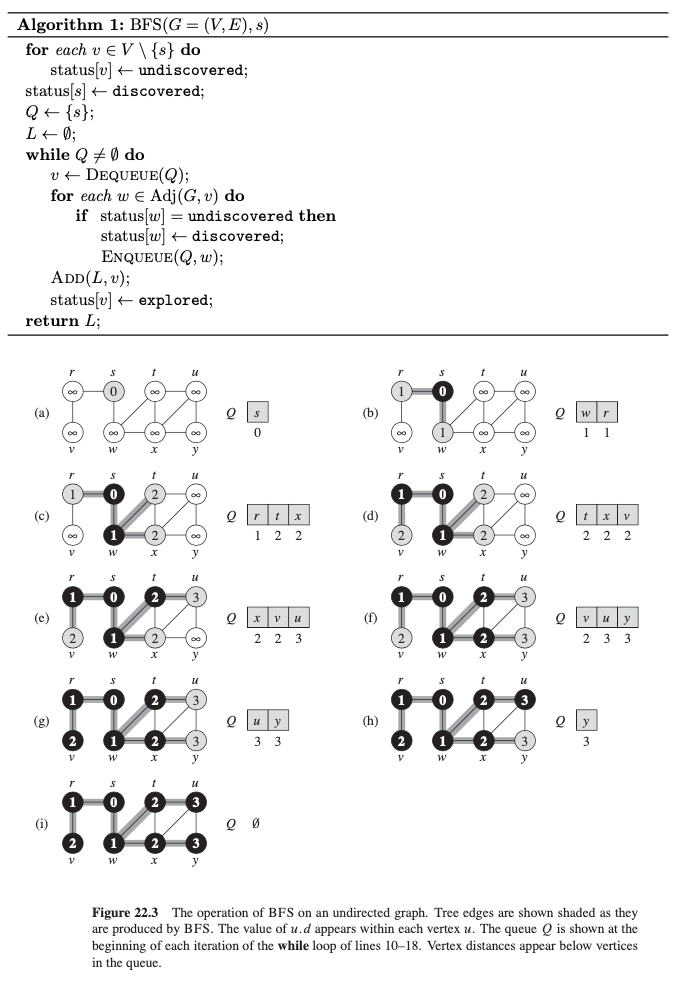
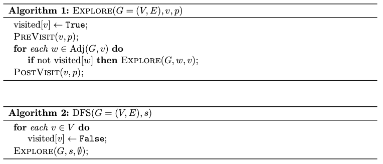

# Graphs

- Set of $V$ vertices and $E$ edges
- DAG - direct acyclic graph, directed graph with no cycles
- Can be implemented with
  - Adjacency list - each vertex has a lsit of vectices to which it has an edge
  - Adjacency matrix - $|V| \times |V|$ Boolean-valued matrix indexed by vertices
  - Space complexity - list
  - Check adjacency - matrix
- Tree - special sort of graph, undirected, connected, no cycle 

## Breadth-First Search

- Uses a **queue**

  

- ==Can be used to compute (minimum) distances from the start vertex==

## Depth-First Search

- Can use a **stack** instead of a queue as above, or
- Recursive (not as good)

- PreVisit - add $v$ to $L$
- PostVisit - output $L$
- ==Can be used to check for cycles==