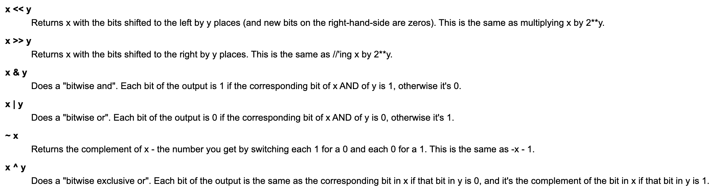

# Primitive Types

## Bits

- Bit manipulation

  - Instead of treating that number as if it were a single value, they treat it as if it were a string of bits, written in twos-complement binary
  - Negative numbers are treated as their 2's complement value

- Operators

  

  ```python
  >>> 4 & 6
  4
  # 4 is 100, 6 is 110 => AND is 100, which is 4
  
  >>> 1 | 2
  3
  # 1 is 1, 2 is 10 => OR is 11, which is 3
  
  >>> 8 >> 1
  4
  # 8 is 1000 => shifts to the right by 1 place, becomes 100, which is 4
  # Same as dividing by 2^1 = 2
  
  >>> 15 ^ 4
  11
  # 15 is 1111, 4 is 100 => XOR is 1011, which is 11
  ```

  - ==AND is used to extract a subset of bits==
  - ==OR is used to set a subset of bits==
  - ==XOR is used to toggle a subset of bits==

- Tricks

  - To extract ith element of a number (starting from i = 0, from the right hand side)

    - If exceeds, will simply return 0

    ```python
    # 44 is 101100
    >>> (44 >> 0) & 1
    0
    >>> (44 >> 1) & 1
    0
    >>> (44 >> 2) & 1
    1
    >>> (44 >> 3) & 1
    1
    >>> (44 >> 4) & 1
    0
    >>> (44 >> 5) & 1
    1
    >>> (44 >> 6) & 1
    0
    ```

  - ^1 can be used to switch bits/Boolean

    ```python
    >>> True ^ 1
    0
    
    >>> False ^ 1
    1
    ```

  - x & (x - 1) equals x with its lowest set bit erased

    ```python
    >>> 44 & (44 - 1)
    40
    # 44 is 101100, 44 - 1 = 43 is 101011
    # AND is 101000
    ```

  - On the contrary, x & ~(x - 1) can be used to isolate the lowest set bit (LSB)\

    ```python
    >>> 44 & ~(44 - 1)
    4
    # 44 is 101100, ~(44 - 1) is 010100
    # AND is 000100
    ```

    

- Example: count the number of bits that are set to 1 in a positive integer

  ```python
  def count_bits(x):
  	num_bits = 0
    while x:
      num_bits += x & 1 # Increment counter if 1
      x >>= 1 # Shift to the right by 1 place, basically divide by 2
    return num_bits
  ```

## Numerics

- Operations

  ```python
  >>> import math
  
  >>> abs(-34.5)
  34.5
  
  >>> math.ceil(2.17)
  3
  
  >>> math.floor(3.14)
  3
  
  >>> min(-5, -3)
  -5
  
  >>> max(3.14, 3.15)
  3.15
  
  >>> pow(2.71, 3.14)
  22.883559193263366
  
  >>> 2.71 ** 3.14
  22.883559193263366
  
  >>> 7 / 2
  3.5
  
  >>> type(7 / 2)
  <class 'float'>
  
  >>> 7 // 2
  3
  
  >>> type(7 // 2)
  <class 'int'>
  
  >>> 7 % 2
  1
  ```

- Numeric to string manipulation

  ```python
  >>> str(42)
  '42'
  
  >>> int('42')
  42
  
  >>> float('42')
  42.0
  
  >>> str(3.14)
  '3.14'
  ```

- Max/min

  ```python
  # Floats are not infinite precision, so comparable to integers
  # These can be used as max-int and min-int
  >>> float('inf')
  inf
  
  >>> float('-inf')
  -inf
  ```

- Random

  ```python
  >>> import random
  
  >>> random.randrange(50, 100, 5) # from 50 to 100 (inclusive), with 5 step-of-range
  80
  
  >>> random.randint(8, 16) # inclusive
  16
  
  >>> random.random() # from 0 to 1
  0.6363022633553427
  
  >>> A = [1, 2, 3]
  >>> random.shuffle(A) # in-place shuffle
  >>> A
  [3, 1, 2]
  
  >>> random.choice(A)
  1
  ```


